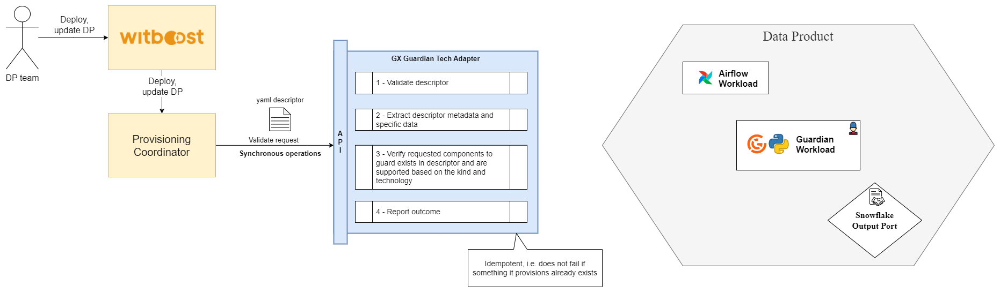
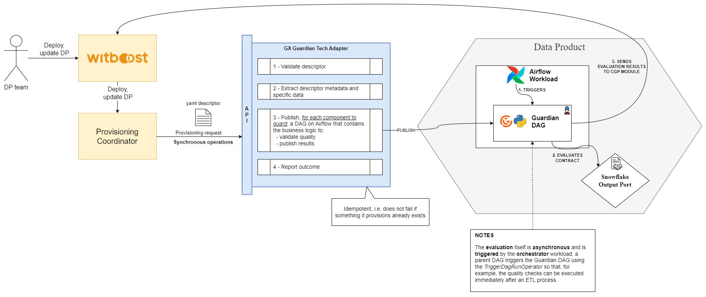
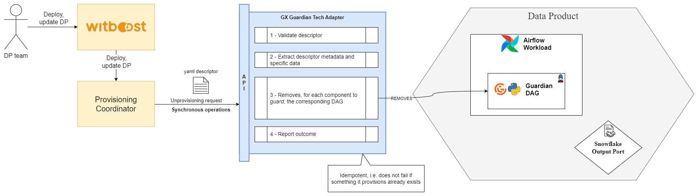

# High Level Design

This document describes the High Level Design of the GX Guardian Tech Adapter.
The source diagrams can be found and edited in the [accompanying draw.io file](hld.drawio).

## Overview

### Tech Adapter

A Tech Adapter (TA), formerly known as Specific Provisioner, is a service in charge of performing a resource allocation task, usually
through a Cloud Provider. The resources to allocate are typically referred to as the _Component_, the
details of which are described in a YAML file, known as _Component Descriptor_.

The TA is invoked by an upstream service of the Witboost platform, namely the Coordinator, which is in charge of orchestrating the creation
of a complex infrastructure by coordinating several TAs in a single workflow. The TA receives
the _Data Product Descriptor_ as input with all the components (because it might need more context) plus the id of the component to provision, named _componentIdToProvision_

To enable the above orchestration a TA exposes an API made up of five main operations:
- validate: checks if the provided component descriptor is valid and reports any errors
- provision: allocates resources based on the previously validated descriptor; clients either receive an immediate response (synchronous) or a token to monitor the provisioning process (asynchronous)
- status: for asynchronous provisioning, provides the current status of a provisioning request using the provided token
- unprovision: destroys the resources previously allocated.
- updateacl: grants access to a specific component/resource to a list of users/groups

### Guardian

A component is considered a **data contract guardian** if it defines the [__dataContractGuardianSpec](https://docs.witboost.com/docs/p1_user/p6_advanced/p6_10_data_contracts/p6_10_2_creating_a_data_contract#guardian-descriptor) property in its descriptor.
A **guardian** is responsible for periodically verifying the compliance of the data contract and reporting the monitoring results to the **Computational Governance Platform**.
More informations are available in the [official documentation](https://docs.witboost.com/docs/p3_tech/p10_data_contracts/p10_2_data_contract_guardian).

### GX

**Great Expectations (GX)** is a framework for describing data using expressive tests and then validating that the data meets test criteria. **GX Core** is a Python library that provides a programmatic interface to building and running data validation workflows using GX.

GX Core is versatile and supports a variety of workflows. It can be used for interactive, exploratory data validation as well as data validation within production deployments.

**GX components** are Python classes that represent your data and data validation entities.

**GX workflows** are programmatically defined data validation processes. GX workflows are built using GX components.

All GX workflows share a common pattern:

1. Set up a GX environment
1. Connect to data
1. Define Expectations
1. Run Validations

### GX Guardian Tech Adapter

The Tech Adapter uses Python and FastAPI to take advantage of the excellent [GX library](https://github.com/great-expectations/great_expectations) available for this language.

The initial implementation supports only Snowflake as a Data Source.

## Validation

## Provisioning

When the Guardian Workload is deployed, the Tech Adapter publish, for each component to guard, a DAG on Airflow that contains the business logic to:
  - validate quality
  - publish results

The evaluation itself is asynchronous and is triggered by the orchestrator workload: a _parent DAG_ triggers the _Guardian DAG_ using the _TriggerDagRunOperator_ so that, for example, the quality checks can be executed immediately after an ETL process.

## Unprovisioning

